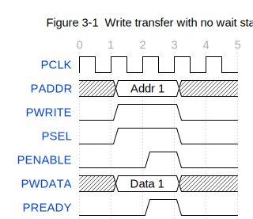
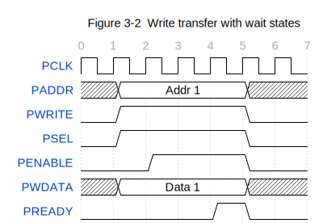
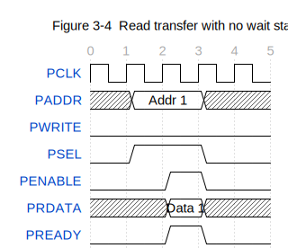
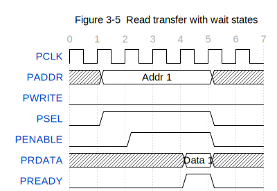
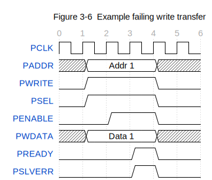
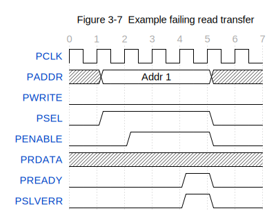
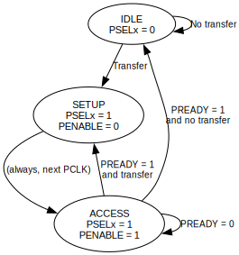

# AMBA APB Protocol — machine-readable capture (Arm IHI 0024E)

> **Source:** *AMBA® APB Protocol Specification*, Arm IHI 0024E (ID022823), Issue E,
> 28 February 2023. © 2003–2023 Arm Ltd. Non-Confidential.
> This file is a faithful, structured re-capture of the technical content for use in this
> project. The original PDF is **not** committed (see `.gitignore`); obtain it from
> <https://developer.arm.com/documentation/ihi0024/e/>.
>
> **Scope note.** Content is captured in full for reference, but this project only *models*
> the **APB-lite core + APB3** subset (see [ADR 0002](../adr/0002-apb-lite-scope.md)).
> Out-of-scope material (APB4 `PPROT`/`PSTRB`, APB5 wake-up/user/parity/RME) is marked
> **[out of scope]** where it appears.

## 1. About the APB protocol

- APB is a **low-cost, low-power, low-complexity** register-access interface.
- It is **not pipelined** and is a **simple synchronous** protocol. **Every transfer takes
  at least two cycles.** All signals are timed against the **rising edge of `PCLK`**.
- Designed for accessing the programmable control registers of peripherals. Peripherals
  attach to the main memory system via an **APB bridge** (e.g. AXI-to-APB, AHB-to-APB).
- **Roles (Issue D+ terminology):**
  - **Requester** — initiates transfers (the APB bridge / master side).
  - **Completer** — responds to requests (the peripheral / slave side).

## 2. Signal descriptions

Width column: `1` fixed; otherwise a property (e.g. `DATA_WIDTH`). A property value of zero
means the signal is **not present**. "Source" is who drives the signal.

| Signal | Source | Width | In scope? | Description |
|--------|--------|-------|-----------|-------------|
| `PCLK` | Clock | 1 | ✅ | Clock. All APB signals timed to its rising edge. |
| `PRESETn` | System reset | 1 | ✅ | Reset, **active-LOW**. Normally tied to the system bus reset. |
| `PADDR` | Requester | `ADDR_WIDTH` | ✅ | Address bus, up to 32 bits. Byte address. |
| `PPROT` | Requester | 3 | ❌ [out of scope] | Protection type (normal/privileged, secure/non-secure, data/instruction). APB4. |
| `PNSE` | Requester | 1 | ❌ [out of scope] | RME extension to protection type. APB5. |
| `PSELx` | Requester | 1 | ✅ | Select — one per Completer. Indicates the Completer is selected and a transfer is required. |
| `PENABLE` | Requester | 1 | ✅ | Enable — indicates the second and subsequent cycles (ACCESS phase) of a transfer. |
| `PWRITE` | Requester | 1 | ✅ | Direction — HIGH = write, LOW = read. |
| `PWDATA` | Requester | `DATA_WIDTH` | ✅ | Write data (8/16/32). Driven during writes (`PWRITE` HIGH). |
| `PSTRB` | Requester | `DATA_WIDTH/8` | ❌ [out of scope] | Write strobe — byte-lane valid. `PSTRB[n]` ↔ `PWDATA[8n+7:8n]`. Must be LOW on reads. APB4. |
| `PREADY` | Completer | 1 | ✅ | Ready — Completer uses it to extend (wait-state) a transfer. APB3. |
| `PRDATA` | Completer | `DATA_WIDTH` | ✅ | Read data (8/16/32). Driven during reads (`PWRITE` LOW). |
| `PSLVERR` | Completer | 1 | ✅ | Transfer error — optional; HIGH indicates an error. APB3. |
| `PWAKEUP` | Requester | 1 | ❌ [out of scope] | Wake-up activity indication. APB5. |
| `PAUSER` | Requester | `USER_REQ_WIDTH` | ❌ [out of scope] | User request attribute. APB5. |
| `PWUSER` | Requester | `USER_DATA_WIDTH` | ❌ [out of scope] | User write-data attribute. APB5. |
| `PRUSER` | Completer | `USER_DATA_WIDTH` | ❌ [out of scope] | User read-data attribute. APB5. |
| `PBUSER` | Completer | `USER_RESP_WIDTH` | ❌ [out of scope] | User response attribute. APB5. |

**Buses (§2.1.1–2.1.2).** Single address bus `PADDR` for both directions; unaligned
`PADDR` is permitted but the result is UNPREDICTABLE. Two independent data buses (`PRDATA`,
`PWDATA`), 8/16/32 bits, **same width**. Read and write cannot occur concurrently (the data
buses share the one handshake).

## 3. Transfers

The two phases of every transfer:

- **Setup phase** — one cycle. `PSEL` asserted; `PADDR`, `PWRITE`, (`PWDATA` for writes),
  and other control must be valid.
- **Access phase** — `PENABLE` asserted. The Completer drives `PREADY`; while `PREADY` is
  LOW the transfer is extended (wait states) and all Requester-driven signals hold stable.
  When `PREADY` is HIGH the transfer completes.

`PREADY` may take any value when `PENABLE` is LOW — so a fixed two-cycle Completer can tie
`PREADY` HIGH.

### 3.1 Write, no wait states (Figure 3-1)

Setup at T1 (`PSEL`↑, `PADDR`/`PWRITE`/`PWDATA` valid); Access at T2 (`PENABLE`↑, `PREADY`
HIGH → data accepted at T3). At the end `PENABLE` deasserts; `PSEL` deasserts unless another
transfer to the same peripheral follows.

### 3.2 Write, with wait states (Figure 3-2)

During Access, the Completer drives `PREADY` LOW to extend. While `PREADY` is LOW these hold
unchanged: `PADDR`, `PWRITE`, `PSELx`, `PENABLE`, `PWDATA`, `PSTRB`, `PPROT`, `PAUSER`,
`PWUSER`.

### 3.2a Write strobes — `PSTRB` [out of scope]

`PSTRB[n]` enables byte lane `PWDATA[8n+7:8n]`. Must be all-LOW on reads. Optional (APB4).

### 3.3 Read, no wait states (Figure 3-4)

Address/control timing identical to writes. The Completer must provide `PRDATA` before the
end of the read.

### 3.3a Read, with wait states (Figure 3-5)

`PREADY` LOW during Access extends the transfer; any number of wait cycles (≥0). While
`PREADY` is LOW these hold: `PADDR`, `PWRITE`, `PSEL`, `PENABLE`, `PPROT`, `PAUSER`.

### 3.4 Error response — `PSLVERR`

`PSLVERR` indicates an error on read or write. It is **only valid during the last cycle of a
transfer, when `PSEL`, `PENABLE`, and `PREADY` are all HIGH.** Recommended (not required) to
be driven LOW otherwise. Key semantics:

- A transaction that errors **may or may not** have changed peripheral state (peripheral-specific).
- A read that errors **may return invalid data**; `PRDATA` is not required to be zeroed.
- Completers need not support `PSLVERR`; if absent, the Requester input is tied LOW.

**Mapping when bridging (§3.4.3):** AXI→APB maps `PSLVERR` to `RRESP`/`BRESP`; AHB→APB maps
it to `HRESP`. *(Bridge mapping only — the AXI/AHB specs are not needed to model APB itself;
see [Dependencies](#dependencies--additional-reading).)*

### 3.5–3.8 [out of scope]

Protection unit (`PPROT`, §3.5), RME (`PNSE`, §3.6), wake-up (`PWAKEUP`, §3.7), and user
signaling (§3.8) are APB4/APB5 features outside this project's scope (ADR 0002).

## 4. Operating states (Figure 4-1)

| State | Condition | Behavior |
|-------|-----------|----------|
| **IDLE** | `PSELx = 0` | Default state. Stays IDLE while no transfer is required. |
| **SETUP** | `PSELx = 1`, `PENABLE = 0` | Entered when a transfer is required. Lasts **exactly one cycle**; always moves to ACCESS on the next rising edge. |
| **ACCESS** | `PSELx = 1`, `PENABLE = 1` | Held while `PREADY = 0`. On `PREADY = 1`: → SETUP if another transfer follows, else → IDLE. |

Signals that **must not change** SETUP→ACCESS and between ACCESS cycles: `PADDR`, `PPROT`,
`PWRITE`, `PWDATA` (writes only), `PSTRB`, `PAUSER`, `PWUSER`.

## Appendix A — Signal validity rules

- **Always valid:** `PSEL`, `PWAKEUP`.
- **Valid when `PSEL` asserted:** `PADDR`, `PPROT`, `PNSE`, `PENABLE`, `PWRITE`, `PAUSER`,
  `PSTRB`, `PWDATA` (active write lanes only), `PWUSER` (write only).
- **Valid when `PSEL` & `PENABLE`:** `PREADY`.
- **Valid when `PSEL` & `PENABLE` & `PREADY`:** `PRDATA` (read only), `PSLVERR`,
  `PRUSER` (read only), `PBUSER`.
- Recommended: drive not-required signals to zero.

## Appendix B — Signal list (presence by revision)

Codes: **Y** mandatory · **N** must not be present · **O** optional ·
**OO** optional output / mandatory input · **C** conditional (present iff property True) ·
**OC** optional-conditional. Default = value used for un-driven inputs.

| Signal | Width | Default | Property | APB5 | APB4 | APB3 | APB2 |
|--------|-------|---------|----------|------|------|------|------|
| `PCLK` | 1 | – | – | Y | Y | Y | Y |
| `PRESETn` | 1 | – | – | Y | Y | Y | Y |
| `PADDR` | `ADDR_WIDTH` | – | – | Y | Y | Y | Y |
| `PPROT` | 3 | `0b000` | – | O | O | N | N |
| `PNSE` | 1 | `0b0` | `RME_Support` | C | N | N | N |
| `PSELx` | 1 | – | – | Y | Y | Y | Y |
| `PENABLE` | 1 | – | – | Y | Y | Y | Y |
| `PWRITE` | 1 | – | – | Y | Y | Y | Y |
| `PWDATA` | `DATA_WIDTH` | – | – | Y | Y | Y | Y |
| `PSTRB` | `DATA_WIDTH/8` | – | – | O | O | N | N |
| `PREADY` | 1 | `0b1` | – | OO | OO | OO | N |
| `PRDATA` | `DATA_WIDTH` | – | – | Y | Y | Y | Y |
| `PSLVERR` | 1 | `0b0` | – | OO | OO | OO | N |
| `PWAKEUP` | 1 | – | `Wakeup_Signal` | C | N | N | N |
| `PAUSER` | `USER_REQ_WIDTH` | – | `USER_REQ_WIDTH` | OC | N | N | N |
| `PWUSER` | `USER_DATA_WIDTH` | – | `USER_DATA_WIDTH` | OC | N | N | N |
| `PRUSER` | `USER_DATA_WIDTH` | – | `USER_DATA_WIDTH` | OC | N | N | N |
| `PBUSER` | `USER_RESP_WIDTH` | – | `USER_RESP_WIDTH` | OC | N | N | N |

**Check signals (Chapter 5, `Check_Type`) — all [out of scope]:** `PADDRCHK`, `PCTRLCHK`,
`PSELxCHK`, `PENABLECHK`, `PWDATACHK`, `PSTRBCHK`, `PREADYCHK`, `PRDATACHK`, `PSLVERRCHK`,
`PWAKEUPCHK`, `P{A,W,R,B}USERCHK` — conditional on `Check_Type` (APB5 only; odd byte parity).

## Revisions (which signals arrived when)

| Issue | Spec name | Added |
|-------|-----------|-------|
| A/B | AMBA 2 APB / APB2 | Base protocol; **PREADY**, **PSLVERR** added in Issue B (→ APB3). |
| C | APB4 | **PPROT**, **PSTRB**. |
| D | APB5 | Width properties; **PWAKEUP**; user signals; interface parity (Ch.5); Requester/Completer terminology; validity rules (App A); signal matrix (App B). |
| E | APB5 | RME support (**PNSE**, §3.6). |

> This project's **APB-lite** target = APB2 base **+ APB3** (`PREADY` wait states, `PSLVERR`
> error). It is the unanimous subset of real open-source implementations.

## Dependencies & additional reading

IHI0024E lists two related Arm documents, both referenced only for features **outside** the
APB-lite core — so **neither is required to model APB itself**:

- **AMBA AXI and ACE Protocol Specification (IHI 0022)** — referenced only by §3.4.3 for the
  bridge mapping of `PSLVERR` to `RRESP`/`BRESP`. Not needed unless modeling an AXI→APB bridge.
- **Arm RME System Architecture Specification (DEN 0129)** — referenced only by §3.6 (`PNSE`),
  which is out of scope.

**Conclusion (WS1.3):** the APB-lite formal model is **self-contained**; the AXI/AHB specs are
deliberately not fetched or converted.
